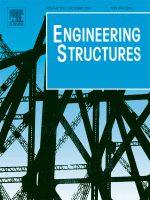
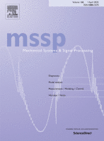
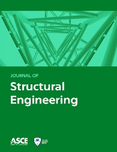
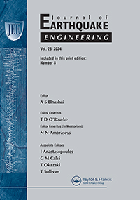

# `^(?:Dr\.\s)?Theodor(?:e)?\s[^ABD-Z]hang$`

* ❎ engineer
* ✅ bug breeder
    * 👍 early returner
    * 👍 never nester
    * 👍 one liner

I am interested in the following computational mechanics related topics:

* couple stress theory
* phase field theory
* nonlinear dynamics
* contact and constraint
* topology optimisation
* constitutive modelling
* finite element formulation

Check my [CV](CV.pdf) or  if you wish.

## Software

1. [suanPan](https://github.com/TLCFEM/suanPan) 🧮 An Open Source, Parallel and Heterogeneous Finite Element Analysis Framework

    Please feel free to request features if you are interested in implementing your research work in suanPan.

2. [motion-base](https://github.com/TLCFEM/motion-base) 🌏 a ground motion database

3. [ezp](https://github.com/TLCFEM/ezp) 🪢 lightweight C++ wrapper for selected distributed solvers

4. [msglc](https://github.com/TLCFEM/msglc) 🗜️ (de)serialize json objects with lazy/partial loading containers using msgpack

5. [VPMR](https://github.com/TLCFEM/vpmr) 🥷 C++/Python implementation of the VPMR algorithm

6. [Damping Dolphin](https://github.com/TLCFEM/damping-dolphin) 🐬 a utility to visualise and generate parameter sets for use in the damping model

7. [alcongrator](https://github.com/TLCFEM/alcongrator) 〰 a utility to generate ground motion history based on given records

## Books

1. [Constitutive Modelling Cookbook](https://github.com/TLCFEM/constitutive-modelling-cookbook) A reference book on constitutive modelling.

    [PDF](https://github.com/TLCFEM/constitutive-modelling-cookbook/releases/download/latest/COOKBOOK.pdf) file is accessible.
    
2. [Introduction to Structural Steel](https://github.com/TLCFEM/introduction-to-structural-steel) A textbook on structural steel in accordance with the AU/NZ standards.

    [PDF](https://github.com/TLCFEM/introduction-to-structural-steel/releases/download/latest/INTRO.pdf) file is accessible.

## Publication Resources

The following repositories contain source code and example models of some publications. Please feel free to cite and use graphs, tables, etc., when necessary.

1.  [gcmq-ijnme](https://github.com/TLCFEM/gcmq-ijnme) A new drilling quadrilateral membrane element with high coarse-mesh accuracy using a modified Hu-Washizu principle [doi:10.1002/nme.6066](https://doi.org/10.1002/nme.6066)
2.  [application-es](https://github.com/TLCFEM/application-es) Numerical evaluations of a novel membrane element in simulations of reinforced concrete shear walls [doi:10.1016/j.engstruct.2019.109592](https://doi.org/10.1016/j.engstruct.2019.109592)
3.  [response-history-application-es](https://github.com/TLCFEM/response-history-application-es) Numerical evaluations of a novel membrane element in response history analysis of reinforced concrete shear walls [doi:10.1016/j.engstruct.2020.110760](https://doi.org/10.1016/j.engstruct.2020.110760)
4.  [generalised-damper-algorithm-mssp](https://github.com/TLCFEM/generalised-damper-algorithm-mssp) Numerical simulation of generalised Maxwell-type viscous dampers with an efficient iterative algorithm [doi:10.1016/j.ymssp.2021.108795](https://doi.org/10.1016/j.ymssp.2021.108795)
5.  [couple-stress-formulation-arxiv](https://github.com/TLCFEM/couple-stress-formulation-arxiv) New mixed formulation and mesh dependency of finite elements based on the consistent couple stress theory [arXiv:2207.02544](https://arxiv.org/abs/2207.02544)
6.  [nm-formulation](https://github.com/TLCFEM/nm-formulation) Reformulation of concentrated plasticity frame element with N-M interaction and generalised plasticity [doi:10.1061/JSENDH.STENG-12176](https://doi.org/10.1061/JSENDH.STENG-12176)
7.  [nonviscous-implementation](https://github.com/TLCFEM/nonviscous-implementation) A strategy for fast evaluation of nonviscously damped systems with arbitrary kernels [doi:10.1016/j.ymssp.2024.111156](https://doi.org/10.1016/j.ymssp.2024.111156)
8.  [dsp-dynamics](https://github.com/TLCFEM/dsp-dynamics) Spurious response due to linear interpolation of input load and some remedies [doi:10.1080/13632469.2024.2372814](https://doi.org/10.1080/13632469.2024.2372814)
9.  [subloading-implementation](https://github.com/TLCFEM/subloading-implementation) On the subloading surface model for metals: some insights and an efficient numerical implementation [doi:10.1007/s00707-025-04339-0](https://doi.org/10.1007/s00707-025-04339-0)
10.  [balloon-v1](https://github.com/TLCFEM/balloon-v1) The Balloon-v1 Model for Metals With Improved Cyclic Response [doi:10.31224/6937](https://doi.org/10.31224/6937)

## Awesome FOSS

This is my personal collection of excellent FOSS projects that I find extremely useful.

1. [deskflow](https://github.com/deskflow/deskflow) A software K(V)M solution. Very convenient for running a dual-monitor setup across two laptops.
2. [localsend](https://github.com/localsend/localsend) A tool for transferring files between devices, especially useful for sharing between PCs and phones. When paired with a VPN, its possibilities expand significantly.
3. [rustdesk](https://github.com/rustdesk/rustdesk) A straightforward and dependable remote desktop application.
4. [hotspot](https://github.com/KDAB/hotspot) A graphical interface for `perf`, great for quick and efficient performance profiling.
5. [sumatrapdf](https://github.com/sumatrapdfreader/sumatrapdf) A lightweight, fast, and no-frills PDF reader that covers all the essentials.
6. [pdfsam](https://github.com/torakiki/pdfsam) A simple tool for merging, splitting, and managing PDF files.
7. [texstudio](https://github.com/texstudio-org/texstudio) A comprehensive LaTeX editor, extremely capable for producing large volumes of documents.
8. [sharex](https://github.com/sharex/sharex) A powerful yet easy-to-use tool for capturing and editing screenshots.
9. [littlenavmap](https://github.com/albar965/littlenavmap) An outstanding, free navigation tool for flight simulation.
10. [tailscale](https://github.com/tailscale/tailscale) A user-friendly VPN solution that eliminates the complexity of manual setup.
11. [qalculate!](https://github.com/Qalculate) Amazing calculator with enriched features.
