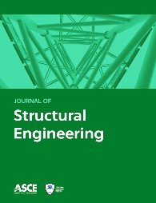

# `^(?:Dr\.\s)?Theodor(?:e)?\s[^ABD-Z]hang$`

* ❎ engineer
* ✅ bug breeder
    * 👍 early returner
    * 👍 never nester
    * 👍 one liner

I am interested in the following computational mechanics related topics:

1. couple stress theory
2. phase field theory
3. dynamics
4. contact and constraint
5. topology optimisation
6. constitutive modelling
7. finite element formulation

Check my [CV](CV.pdf) or  if you wish.

## Software

1. [suanPan](https://github.com/TLCFEM/suanPan) 🧮 An Open Source, Parallel and Heterogeneous Finite Element Analysis Framework

    Please feel free to contact me if you are interested in implementing your research work on suanPan. I am happy to collaborate in this regard.

2. [Damping Dolphin](https://github.com/TLCFEM/damping-dolphin) 🐬 A utility to visualise and generate parameter sets for use in the damping model

3. [Alcongrator](https://github.com/TLCFEM/alcongrator) 〰 A utility to generate ground motion history based on given records

4. [VPMR](https://github.com/TLCFEM/vpmr) 🥷 C++/Python implementation of the VPMR algorithm

## Books

1. [Constitutive Modelling Cookbook](https://github.com/TLCFEM/constitutive-modelling-cookbook) A reference book on constitutive modelling.

    [PDF](https://github.com/TLCFEM/constitutive-modelling-cookbook/releases/download/latest/COOKBOOK.pdf) file is accessible.
    
2. [Introduction to Structural Steel](https://github.com/TLCFEM/introduction-to-structural-steel) A textbook on structural steel in accordance with the AU/NZ standards.

    [PDF](https://github.com/TLCFEM/introduction-to-structural-steel/releases/download/latest/INTRO.pdf) file is accessible.

## Publication Resources

The following repositories contain source code and example models of some publications. Please feel free to cite and use graphs, tables, etc., when necessary.

1.  [gcmq-ijnme](https://github.com/TLCFEM/gcmq-ijnme) A new drilling quadrilateral membrane element with high coarse-mesh accuracy using a modified Hu-Washizu principle [doi:10.1002/nme.6066](https://doi.org/10.1002/nme.6066)
2.  [application-es](https://github.com/TLCFEM/application-es) Numerical evaluations of a novel membrane element in simulations of reinforced concrete shear walls [doi:10.1016/j.engstruct.2019.109592](https://doi.org/10.1016/j.engstruct.2019.109592)
3.  [response-history-application-es](https://github.com/TLCFEM/response-history-application-es) Numerical evaluations of a novel membrane element in response history analysis of reinforced concrete shear walls [doi:10.1016/j.engstruct.2020.110760](https://doi.org/10.1016/j.engstruct.2020.110760)
4.  [generalised-damper-algorithm-mssp](https://github.com/TLCFEM/generalised-damper-algorithm-mssp) Numerical simulation of generalised Maxwell-type viscous dampers with an efficient iterative algorithm [doi:10.1016/j.ymssp.2021.108795](https://doi.org/10.1016/j.ymssp.2021.108795)
5.  [couple-stress-formulation-arxiv](https://github.com/TLCFEM/couple-stress-formulation-arxiv) New mixed formulation and mesh dependency of finite elements based on the consistent couple stress theory [arXiv:2207.02544](https://arxiv.org/abs/2207.02544)
6.  [nm-formulation](https://github.com/TLCFEM/nm-formulation) Reformulation of Concentrated Plasticity Frame Element With N-M Interaction and Generalised Plasticity [doi:10.1061/JSENDH.STENG-12176](https://doi.org/10.1061/JSENDH.STENG-12176)
7.  [nonviscous-implementation](https://github.com/TLCFEM/nonviscous-implementation) A Strategy for Fast Evaluation of Nonviscously Damped Systems With Arbitrary Kernels [doi:10.1016/j.ymssp.2024.111156](https://doi.org/10.1016/j.ymssp.2024.111156)
